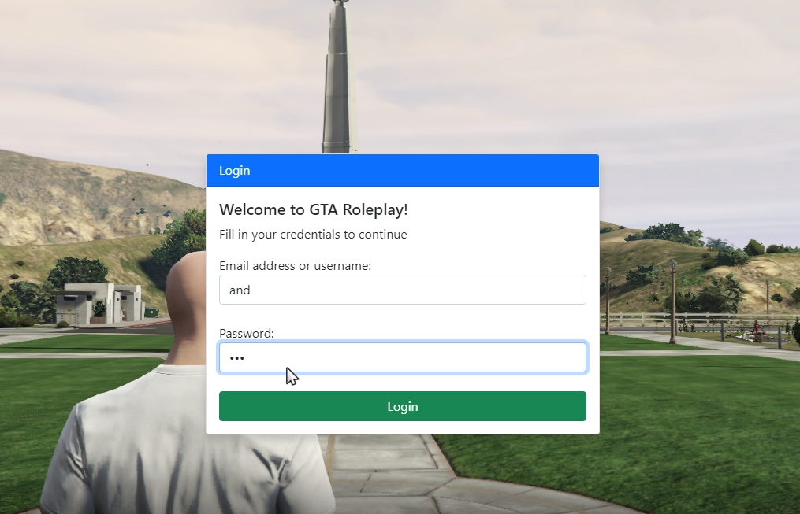
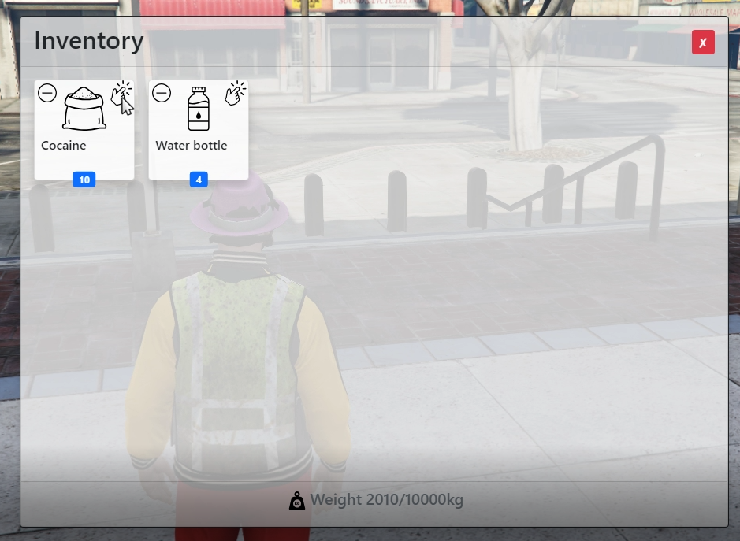
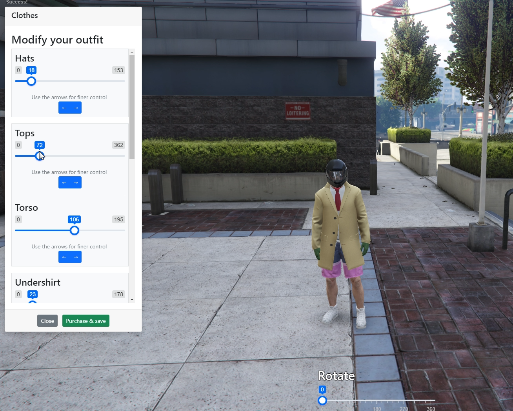
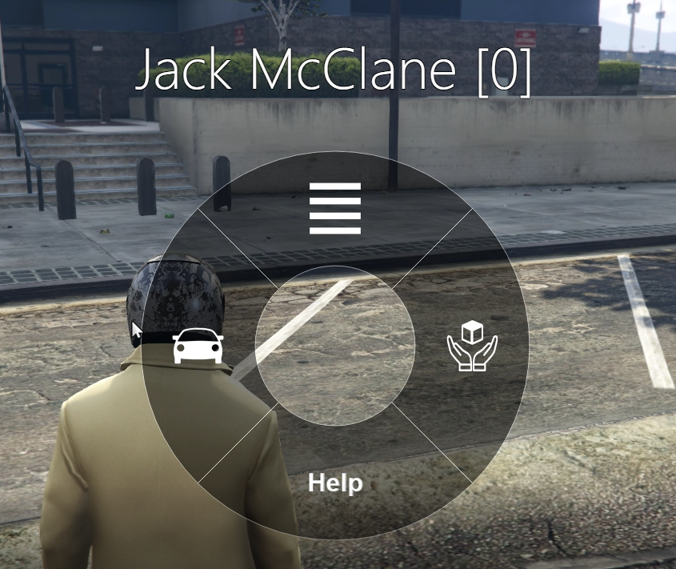
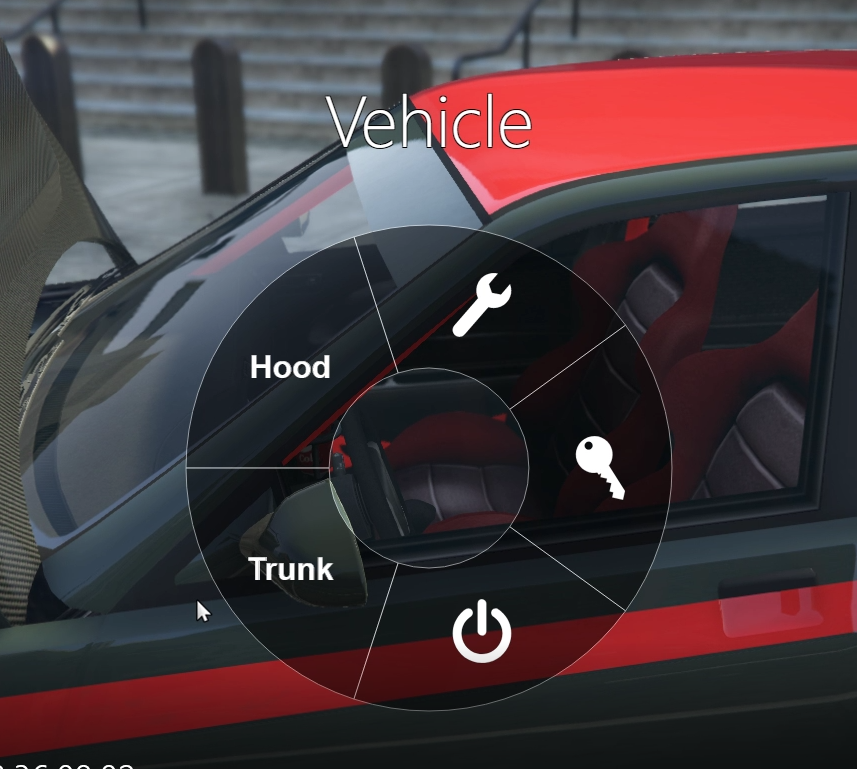
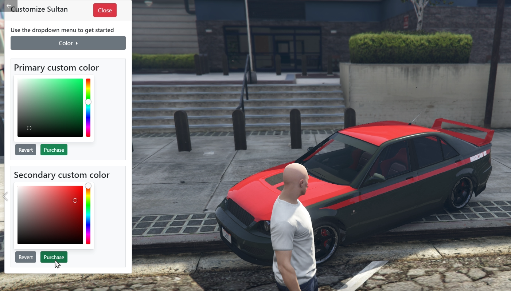
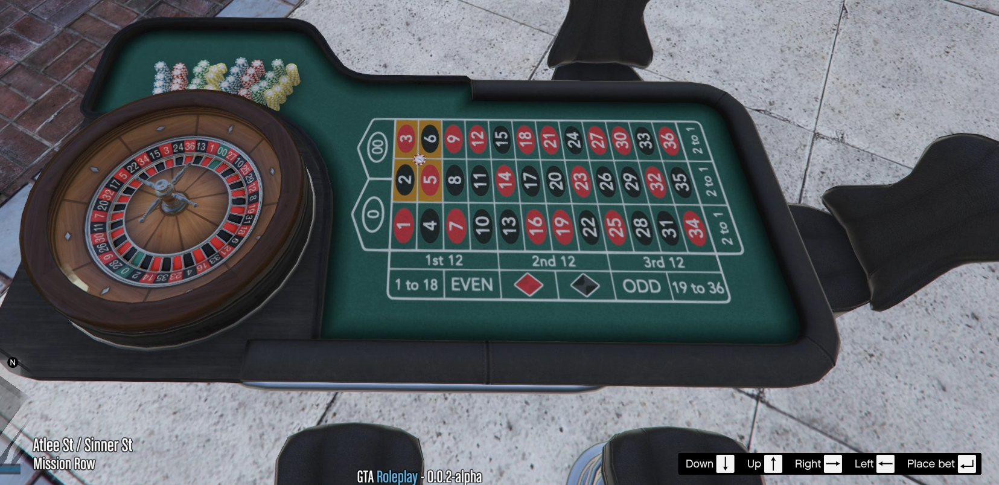

<a name="readme-top"></a>
<!-- PROJECT LOGO -->
<div align="center">
<h3 align="center">Roleplay Gamemode for RageMP</h3>

  <p align="center">
    The gamemode contains various features and a core foundation in place for expansion. 
    <br />
    <a href="https://github.com/Andreas1331/ragemp-roleplay/tree/main/GTARoleplay/GTARoleplay"><strong>Explore the code</strong></a>
    <br />
    <p>Disclaimer: This is not affiliated nor endorsed by Take2.</p>
  </p>
</div>

<!-- TABLE OF CONTENTS -->
<details>
  <summary>Table of Contents</summary>
  <ol>
    <li><a href="#about-the-project">About The Project</a></li>
    <li><a href="#prerequisites">Prerequisites</a></li>
    <li><a href="#getting-started">Getting Started</a></li>
    <li><a href="#optional-heightmap">Optional: HeightMap</a></li>
    <li><a href="#screenshots">Screenshots</a></li>
    <li><a href="#license">License</a></li>
    <li><a href="#contact">Contact</a></li>
    <li><a href="#acknowledgments">Acknowledgments</a></li>
  </ol>
</details>


<!-- ABOUT THE PROJECT -->
## About The Project

After being affiliated with other gaming communities as a developer I decided to try and create my own gamemode from scratch. The plan was however never to start up my own server, but rather release my take on a roleplay gamemode where I could try out things my way. The project is written in C# server-side and JavaScript client-side. 

At the current state the following is implemented:
* Account system with CEF login screen
* Dynamic animation system with proper player positioning
* Character system that allows for as many characters as you wish linked to an account
* Advanced inventory & item system with item bases saved in the database
* Inventory menu using CEF
* Database system utilizing Entity Framework for ORM querying
  * Multiple providers included out of the box (PostgreSQL, MySQL or InMemory)
* Clothing customizer using CEF
* Vehicle tuning using CEF
* System for interacting with any object in the gameworld
* Interactionwheel to interact with objects and perform actions
* Binding server-side actions to keystrokes from clients
* Playable roulette with multiple players
* and more ...

I originally began development in 2021 and abandoned the project again due to time constraints, and I'm revisiting the project once in a while whenever I have the time for it. Also note that some references to SVG (specifically for item icons) files will be null pointers as the files are removed. This is due to copyright, even though they are free for commercial use I've removed them and you'll have to include your own. 

The setup in Visual Studio abstracts away some of the tedious tasks, such as moving client files written in Javascript into the server folder everytime you wish to test something. This is achieved using post build commands inside Visual Studio to copy the files into wherever you have your server folder located. By default the project is using an InMemory Database Provider for Entity Framework so you do not have to setup any dedicated database to get started. Automation for copying the project after compiling is also done using post build commands, and every dependency is moved to the Rage runtime folder. For all of this to work you will need to instruct Visual Studio where your Rage server is located, but more on that in [Getting started](#Getting-Started).

<p align="right">(<a href="#readme-top">back to top</a>)</p>

## Prerequisites

Make sure to have the following installed. Newer versions might be supported as well, but this has not been tested. It is important you have the correct versions of Entity Framework Core and MySQL Server, otherwise you'll get errors. Newer MySQL servers releases seems to have issues with older versions of Entity Framework Core.
* Visual Studio 2019+
* .NET Core v3.1
* BCrypt.Net-Next v4.0.2
* Microsoft.EntityFrameworkCore.Tools v3.1.10
* MySQL.Data.EntityFrameworkCore v8.0.22
* Microsoft.EntityFrameworkCore.InMemory v5.0.17
* Npgsql.EntityFrameworkCore.PostgreSQL v5.0.10
* Pomelo.EntityFrameworkCore.MySql v5.0.4
* Newtonsoft.Json v13.0.1
* RageMP server
* *Optional: RageMP HeightMap data file https://github.com/Andreas1331/ragemp-gtav-heightmap*

<p align="right">(<a href="#readme-top">back to top</a>)</p>

<!-- GETTING STARTED -->
## Getting started

To get your server up and running there's a few things we need to prepare first. This involves gettting the source-code of the project, getting a fresh copy of a Rage server etc. Refer to the checklist below to ensure you got everything ready.
* Download the GitHub project
* Download an instance of RageMP server ([Get a Rage Server](#Getting-a-Rage-server))
* Setup Visual Studio ([Setup your Visual Studio project](#Setup-your-Visual-Studio-project))
* *Optional: Set up a dedicated database* ([Setup a database](#Setup-a-database))
* *Optional: Set up debugger in Visual Studio* ([Attach debugger](#Attach-debugger))


### Getting a Rage server
The Rage installation no longer comes with the server files by default, and you will need to get them yourself. Navigate to your Rage installations folder and find the file ```config.xml```. In here you will find the property *channel*. It will most likely be *prerelease*, but you have to change this to *prerelease_server*. Now run the Rage client, and it should automatically download a fresh server folder for you. This will be called *server-files* inside your Rage installations folder.
I recommend you copy the folder and put it somewhere else. It is up to you where. It does not matter.

### Setup your Visual Studio project
Next step, is to setup our output path inside Visual Studio so our client files and compiled C# project will go to the proper folder. We assume you already have your Rage server downloaded and ready at this point - otherwise go to [Get a Rage Server](#Getting-a-Rage-server).
Right click the GTARoleplay project and select *Edit Project File*. Find the *ServerPath* variable. Change this to match where you put your Rage server folder. 
```
  <PropertyGroup>
    <ServerPath>YOUR_RAGE_FOLDER_PATH_GOES_HERE</ServerPath>
  </PropertyGroup>
```
My path example:
```
  <PropertyGroup>
    <ServerPath>C:\RAGEMP-Servers\GTARoleplay\server-files</ServerPath>
  </PropertyGroup>
```

Now everytime you build the solution inside Visual Studio the .DLL is automatically placed in your server folder. If you go looking for it before building you will not find it. However, once Visual Studio builds the project, the DLL is placed here:
```YOUR_RAGE_SERVER_FOLDER\dotnet\resources\GTARoleplay```

To view what Visual Studio is doing for each time you build, right click the GTARoleplay project:
> Properties -> Build Events -> Post-build event command line

Here you will see the instructions that are moving all client-files as well as server-files required for the gamemode to run. It is also ensuring to move the dependencies of the gamemode to the runtime folder of your Rage server folder. This is also where you will add new copy commands when you add your own client folders in the future. The reason for setting up the project this way was to have the server files and client files stored near their relevance when developing.

Last step is to build the entire solution in Visual Studio. So hit CTRL + SHIFT + B and watch how it moves everything to your server folder. 

### Setup a database

If you wish to use a dedicated database you will have to download one and host it either remote or locally. Once you have a running database such as either a MySQL or PostgreSQL it is thankfully very easy to set it up as we will use Entity Framework and rely on it to create our database schema and all related tables. Depending on whether you use MySQL or PostgreSQL you will need to make changes in the project to utilize your chosen database.<br/>
**Open up the GTARoleplay solution using Visual Studio - then navigate to the database files**
> GTARoleplay > Database -> Providers

In here you will find one file per provider available. Open the one matching the database you are running and alter the credentials.
Afterwards we will need to instruct our gamemode to use this provider throughout.
> GTARoleplay > Provider -> ServicesContainer.cs

Find the invocation of *AddDbContext(..)* and use the name of the class that matches the database you are running.

#### Only applicable if you are NOT using InMemory
With your new database running we will need to populate it, so once more open the Visual Studio solution. 

Now from within Visual Studio we will open the Package Manager Console. Beaware if your Visual Studio for some reason didn't download the NuGet packages you will not be able to run the commands. Refer to the list of dependencies and versions mentioned previously. Otherwise navigate to:
> View -> Other Windows -> Package Manager Console

The command needs an argument instructing it which DbContext we are using. Either MySQL or PostgreSQL. Check the commands below and choose which suits your need. When you run the following commands your initial migration script is created based on our entities defined in the gamemode. When invoking the update, Entity Framework will execute the migration against your running database to create schema and tables.

```
add-migration InitialCreate -context MySQLDatabase
update-database
```
or
```
add-migration InitialCreate -context PostgreSQLDatabase
update-database
```

Note this will create a Migrations folder to keep your database state consistent across the board if you are multiple developers with each their local database running. If everything ran smoothly you can use any schema viewer such as MySQL Workbench or PgAdmin to open up your newly created schema and see that all of the tables have been successfully created according to the code.


## Attach debugger
If you wish to attach the debugger to the server you can use the shortcut F5 from Visual Studio, instead to build and start the server automatically. For this however you must also edit the path for the debugger. So once more right click the GTARoleplay project:
> Properties -> Debug

Edit the Executable and Working Directory to match your paths. For me they will be
```C:\GTARoleplay\server-files\ragemp-server.exe``` and ```C:\GTARoleplay\server-files``` respectively.

<p align="right">(<a href="#readme-top">back to top</a>)</p>

<!-- HEIGHTMAP -->
## Optional: HeightMap

You are welcome to grab my heightmap file from my other repository at 

https://github.com/Andreas1331/ragemp-gtav-heightmap

if you wish to make use of the file ```MapDataLibrary.cs``` in the gamemode. This file allows you to teleport the player to any given X,Y coordinate and setting his Z-value to fit the ground. In order to incoporate it into this project you'll need to download the folder ```data_file``` and place it in your server root folder.
Once you've moved the folder to the root folder it should reside along side the ```ragemp-server.exe``` file.

<p align="right">(<a href="#readme-top">back to top</a>)</p>

<!-- SCREENSHOTS -->
## Screenshots

Login             |  Inventory
:-------------------------:|:-------------------------:
  |  


<div align="center"><h3>Clothing customizer</h3></div>

Character wheel             |  Vehicle wheel
:-------------------------:|:-------------------------:
  |  

<div align="center"><h3>Vehicle customizer</h3></div>

<div align="center"><h3>Roulette</h3></div>

<p align="right">(<a href="#readme-top">back to top</a>)</p>

<!-- LICENSE -->
## License

Distributed under the MIT License. See `LICENSE.txt` for more information.

<p align="right">(<a href="#readme-top">back to top</a>)</p>


<!-- CONTACT -->
## Contact

Discord andreas0290

<p align="right">(<a href="#readme-top">back to top</a>)</p>


<!-- ACKNOWLEDGMENTS -->
## Acknowledgments

* [Captien for providing a nice script to show native instructional buttons](https://rage.mp/files/file/148-instructional-buttons/)
* [The wheelnav.js by softwaretailoring.net](http://wheelnavjs.softwaretailoring.net/)
* [Timerbars by root-cause to easily show native timer bars](https://github.com/root-cause/ragemp-timerbars)
* [Logic for getting the minimap anchoring points by glitchdetector](https://github.com/glitchdetector/fivem-minimap-anchor)
* [Proper torso combination for clothing by root-cause](https://github.com/root-cause/v-besttorso)

<p align="right">(<a href="#readme-top">back to top</a>)</p>
